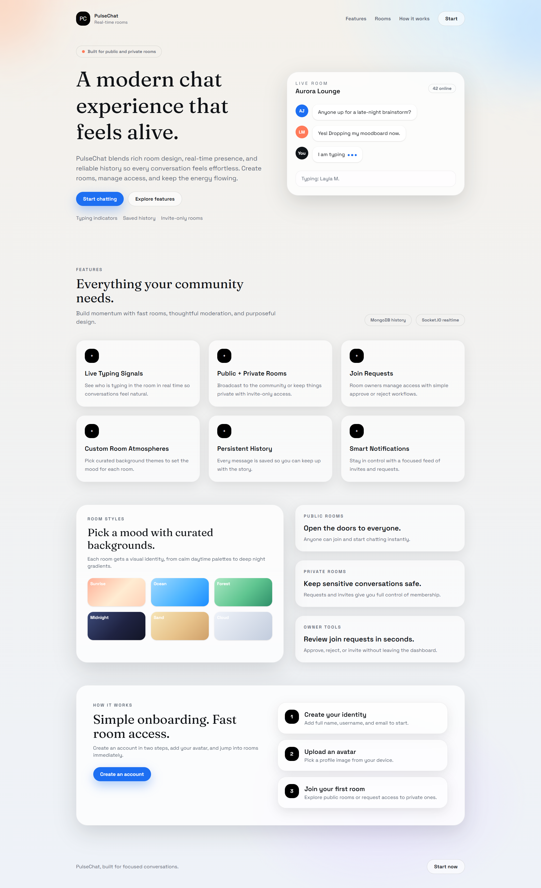
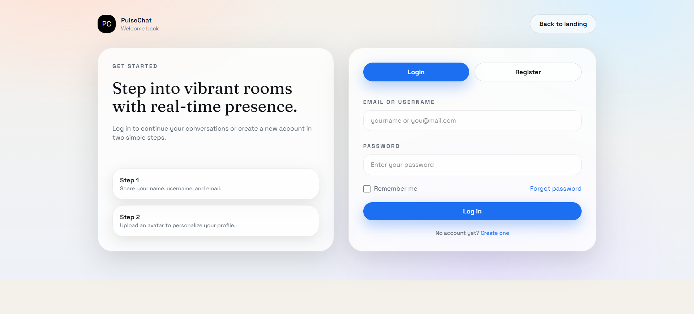
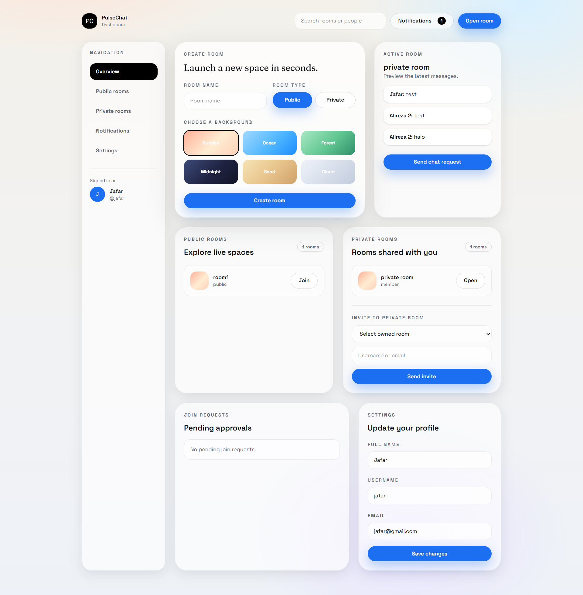
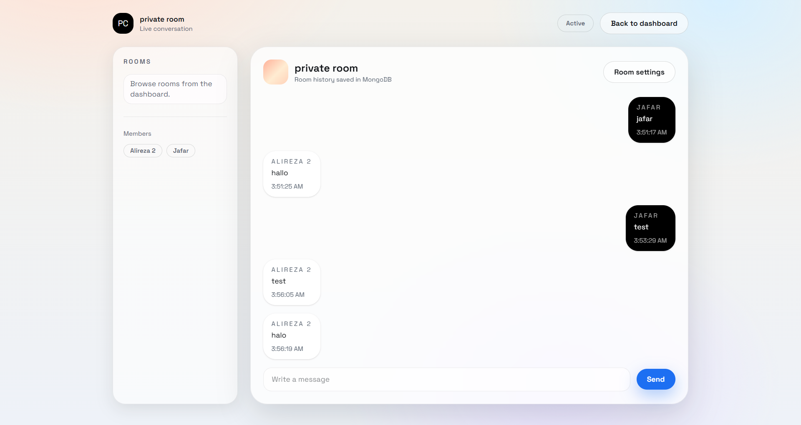

# Realtime Chat Application

A full-featured realtime chat application built with **Next.js**, **Node.js**, and **Socket.IO**.  
This project supports public and private chat rooms, real-time messaging, and user authentication.

## Features
- Landing page with project introduction and start button
- User authentication (Login & Register)
- User dashboard
- Public chat rooms
- Private chat rooms with join request system
- Create public or private chat rooms
- Real-time messaging using Socket.IO
- Edit user profile information

## Tech Stack
- Frontend: Next.js (React)
- Backend: Node.js (Express)
- Realtime Communication: Socket.IO
- Authentication: JWT
- Database: MongoDB

## Application Pages
- Landing Page
- Login & Register
- Dashboard
- Public & Private Chat Rooms
- User Profile

## Project Structure
- `/frontend` – Next.js app
- `/backend` – Node.js & Socket.IO server

## Getting Started

### Backend
```bash
cd backend
npm install
cp .env.example .env
npm run dev
```

### Frontend
```bash
cd frontend
npm install
npm run dev
```

## Screenshots





## Notes
- Screenshots are located in the `/screenshots` directory.
- Environment variables are required for both frontend and backend.
